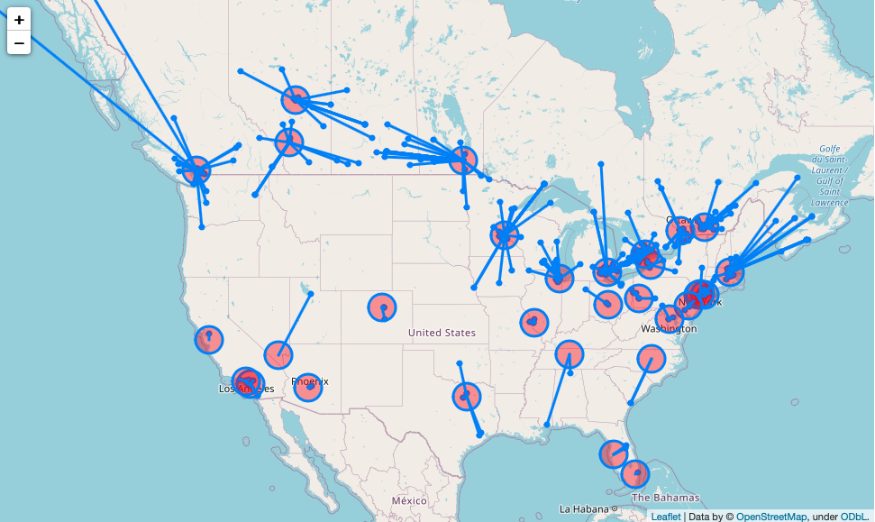
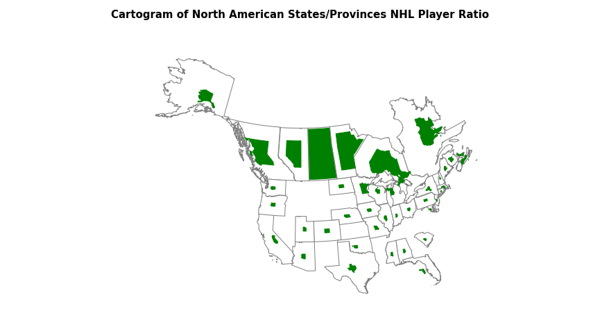
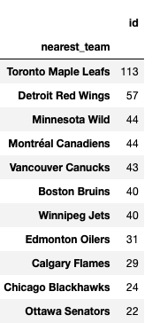
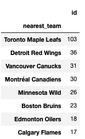

# NHL Player Birthplaces 

## Description
Hockey is, and necessarily will be, a regional sport. This has less to do with cultural (like it is for the American/Canadian football divide) and more to do with the weather -- if it isn't cold where you live, how can you play a sport on ice? To take an extreme example, [Hawaii only has one ice rink in the entire state](https://www.icepalacehawaii.com/about) and, for obvious reasons, does not have any frozen lakes. So it makes sense why there has never been a [Hawaiian born and raised hockey player](https://www.hockey-reference.com/friv/birthplaces.cgi).

Besides weather, there are clearly some other factors at play for determining the areas that produce NHL players. New York City has a population of about 8.5 million people and 2 current NHL players born in the city. Toronto, on the other hand, has a little less than 3 million people and has **27** players born within the city! Weather may have something to do with this (you would definitely know the difference between the two winters, that's for sure...), but it surely isn't the whole story. Therefore, in order to learn a little more about where *competitve* hockey is played and produces NHL players, **I examined the birthplaces of all current NHL players**. 

This project will help the casual NHL fan understand more about the players who play professionally. Having a local player on the team won't be surprising for a Toronto Maple Leaf fan but is like winning the lottery for a Nashville Predator fan (lucky for them there is one right now!). Moreover, this will be useful for any rising youth hockey player and their parents understand more about what it takes to rise to the NHL. It is easy to see which areas of North America are hockey powerhouses, and which ones are on the periphery. 

## Data
I gathered data by using the NHL API to get the names of each of the current NHL players (2021 season) and the names of their birth city and state/province. In addition, I got the names of each of the teams and the location of their arenas.

From there, I used the geopy library to get the coordinates of each players' birth city, as well as the coordinates of each arena. I then used the Shapely and GeoPandas libraries to calculate which team's arena was closest to each player and found the haversine distance (i.e.: the "as the crow flies") to that arena.  

With this information available, I was able to plot the data using Folium, and add lines to the closest team for each player using Shapely. From there, I looked at the number of players who were born close to an NHL team and the number of players per province/state. 

## Findings 
There were many surprising findings in this project. While it is well known that there are a lot of Canadian NHL players (8 of the top state/provinces nhl players per person were Canadian), certain provinces are much more likely to produce an NHL player than others. Quebec, once a province that had 2 NHL teams, is 4 times less likely to have an NHL player than Saskatchewan (a region with zero NHL teams). Similarly, one U.S. state stands out far above the rest: Minnesota. It has more NHL players per person than some Canadian provinces! 

If tomorrow the NHL forced all players to play for their "home" team, only 11 teams would still exist. Even accounting for the ~30% of non-North American players, this finding holds. Those teams can be found in the following screenshot: 

If we limited the players to playing on a team that is within 60 miles of their hometown, the number of viable NHL teams then drops to 8: 

Most Canadian teams would still survive in this scenario: only Ottawa and Winnepeg would be excluded. 

Moreover, it's no surprise that northern U.S. teams are more likely to have local NHL players. With a new Seattle team joining next season, this begs the question: how many local NHL players could the Seattle team have? The answer? Only 2. All other local players are much closer to Vancouver. It appears that even a northern team could have fewer local players than a southern team like the Tampa Bay Lightning or even Arizon Coyotes! 

Taken together, we see the importance of geography in producing NHL talent. However, there is an important caveat in that many players did not spend most of their time playing where they were born: [the Mississippi born Mathieu Olivier grew up playing in Montreal, QC](https://en.wikipedia.org/wiki/Mathieu_Olivier) and the [only Dutch player to ever play in the NHL](https://en.wikipedia.org/wiki/Daniel_Sprong) moved to Quebec to play hockey at age 8. While someone's birthplace tells us a lot, it still leaves open the thorny question of where and *how* one became an NHL player. This question seems to be beyond the scope of this analysis, but I hope it helped to shed more light on the issue. 

## Technologies
- Python
    - haversine
    - Shapely
    - GeoPandas
    - Folium
    - Pandas
    - Seaborn
    - GeoPy
    - Requests
- Jupyter Notebook

